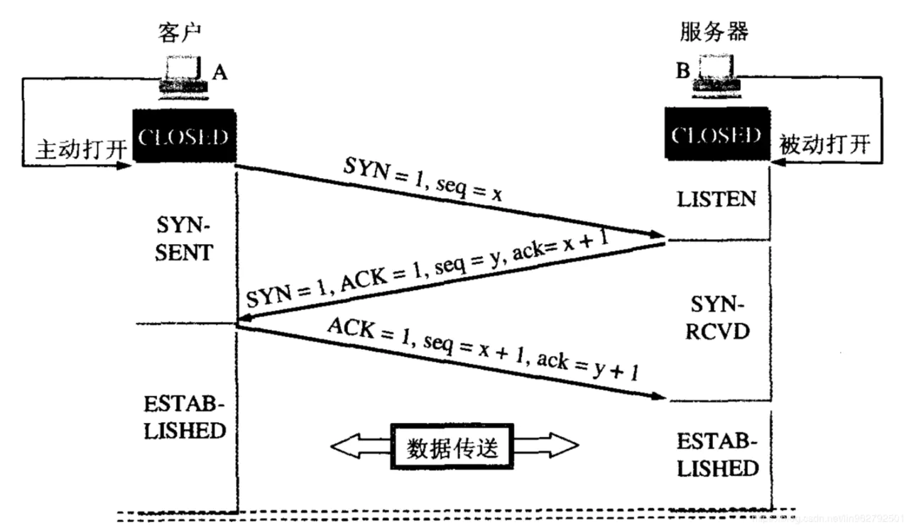
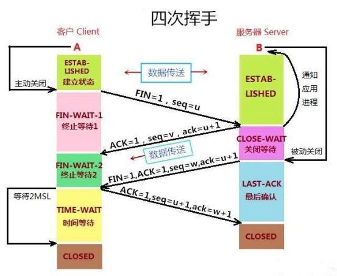

### 输入URL到页面渲染的过程

1. 浏览器解析IP地址
2. 根据IP地址建立tcp连接
3. 发起http请求
4. 服务端收到请求，浏览器接受响应
5. tcp连接关闭
6. 浏览器解析资源渲染页面

#### 浏览器解析IP地址
浏览器拿到url后，会将url解析为IP地址，首先会查本地缓存，如果存在相应的缓存，取之，之后会请求上级dns服务器，拿到ip地址（如果找不到，会一直查到dns服务器根节点）

### 建立tcp连接
浏览器客户端会和服务端进行三次握手，由客户端发起 syn -> syn/ack -> ack，建立tcp连接后进行数据响应

### 发起http请求
tcp连接建立后，浏览器向服务器发起http请求，http请求包含请求起始行，请求头，请求体。服务器接收到请求后，会返回一个response对象，包含了状态码，响应头，响应报文

    //General
    Request Url: 服务器地址
    Request Method: 请求方式（get, post, options, put, head, delete, connect, trace）
    Status Code: 请求返回的状态码
    Remote Address: 请求的远程服务器地址（IP）
    Referrer Policy: （引用策略）用来监管哪些访问来源信息【not IE】

    // Request Head
    Accept: 接受类型，浏览器支持的MIME类型（对标服务端放回的Content-Type）
    Accept-Encoding: 浏览器支持的压缩类型，如gzip等，超出类型不能接受
    Content-Type: 客户端发送出去的实体内容的类型
    Cache-Control: 指定请求和响应遵循的缓存机制，如no-cache,no-store
    If-Modified-Since: 对应服务端你的Last-Modified, 用来匹配文件是否变动，只能精确到1s之内，http1.0中
    Expires: 缓存到期时间，（服务端时间）http1.0中
    Max-age: 代表资源在本地缓存多少秒， http 1.1中
    If-None-Match: 对应的服务端的ETag，用来匹配文件内容是否改变（非常精确），http1.1中
    Cookie: 有cookie并且同域访问会自动带上
    Connection: 当浏览器与服务器通信时对于长链接如何进行处理，如keep-alive;
    Host: 请求的服务器URL
    Origin: 最初的请求是从哪里发起的（只会精确到端口）,origin比Referrer更尊重隐私
    Referrer: 该页面的来源URL（适用于所有类型的请求，会精确到详细页面地址，CSRF拦截常用到这个字段）
    User-Agent: 用户客户端的一些必要信息，如UA头部等;

    // Response Head
    Access-Control-Allow-Headers: 服务端允许的请求的headers
    Access-Control-Allow-Methods: 服务端允许的请求方法
    Access-Control-Allow-Origin: 服务端允许的Origin头部
    Content-Type: 服务端返回的实体内容的类型
    Date: 数据从服务端发送的时间
    Cache-Control: 告诉浏览器或其他客户，什么环境可以安全的缓存文档
    Last-Modified: 请求的资源最后修改时间
    Expires: 文档什么时候过期，从而不再缓存
    Max-age: 客户端的本地资源应该缓存多少秒，开启Cache-Control后有效
    ETag: 请求变量的实体标签的当前值
    Set-Cookie: 设置和页面关联的cookie,服务器通过这个头部把cookie传给客户端
    keep-alive: 如果客户端有keep-alive, 服务端也会有相应（如timeout = 38）
    Server: 服务器的一些相关信息

### 浏览器解析资源渲染页面
浏览器拿到html和css后会构建一个dom树（深度优先，先构建子树，在构建兄弟树）和css树，在这之中，如果遇到scrpit标签，构建将会停止之后将两棵树合并为一颗渲染树，在浏览器内将渲染树渲染成对应页面

### 浏览器接受数据，关闭tcp连接
服务端返回数据后，浏览器拿到对应数据，之后关闭tcp连接，进行四次挥手，由客户端发起 FIN(client) -> ACK(server) -> FIN(server) -> ACK(client)

